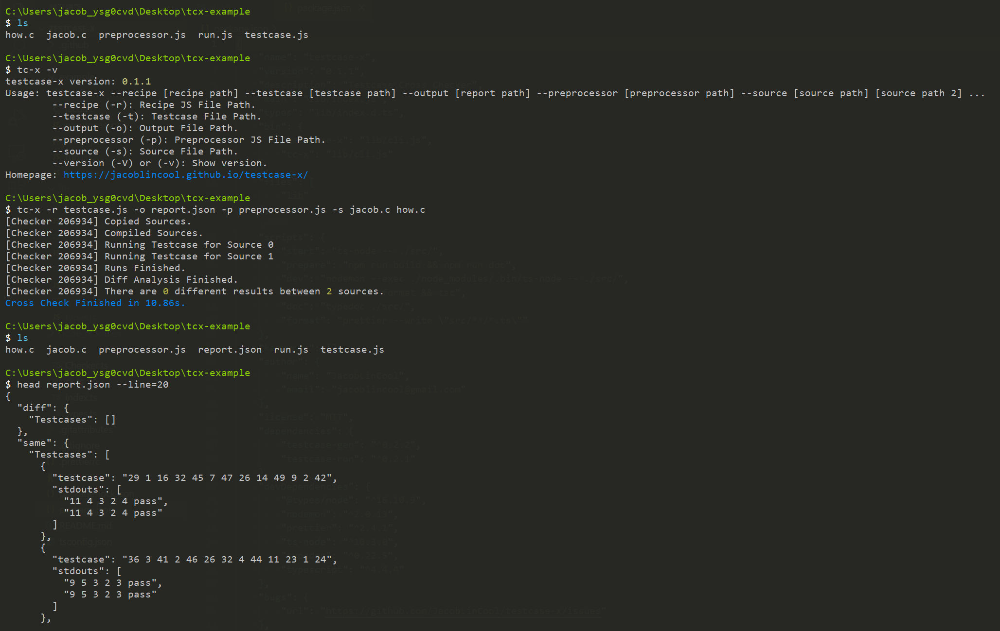

# Testcase X

Testcase Cross Checker

 [](https://www.npmjs.com/package/testcase-x)

> Actually it is a program output cross checker.
> 
> But also generate testcases using simeple but highly flexible rules. (By [**testcase-gen**](https://www.npmjs.com/package/testcase-gen))

## Features

- Generate testcases by simple rules.

- Check output with customizable preprocessor.

## How to Use

### 1. Install

```bash
npm i testcase-x
```

### 2. Run Cross Checker

```javascript
const { writeFileSync, readFileSync } = require("fs");
const { join } = require("path");
const { Checker } = require("../lib");

const c = new Checker()
    .source(readFileSync(join(__dirname, "jacob.c"), "utf8"))
    .source(readFileSync(join(__dirname, "how.c"), "utf8"))
    .genTestcase(require("./testcase.js"))
    .setPreprocessor(require("./preprocessor.js"));

c.go().then((diff) => {
    writeFileSync(join(__dirname, "result.json"), JSON.stringify(diff, null, 2));
});
```

For More Details, See [EXAMPLE](https://github.com/JacobLinCool/testcase-x/tree/main/example).

## CLI Tool



### Install CLI

```bash
npm i -g testcase-x
```

### Use CLI

```bash
testcase-x --recipe [recipe path] --testcase [testcase path] --output [report path] --preprocessor [preprocessor path] --source [source path] [source path 2] ...
        --recipe (-r): Recipe JS File Path.
        --testcase (-t): Testcase File Path.
        --output (-o): Output File Path.
        --preprocessor (-p): Preprocessor JS File Path.
        --source (-s): Source File Path.
        --version (-V) or (-v): Show version.
```
